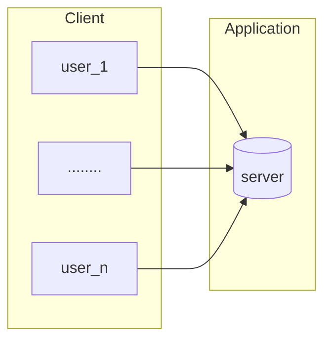

# kafka

## Distributed Users

* https://www.google.com
  * URL: https://www.google.com
  * url parser: local and network
  * http default port: 80
  * https default port: 443

#### Monolith Server


#### Server-side load balancing: when single server cannot support the amount requests from users, we need to
add more servers.
  * Load balancer sites between users and backend servers, receiving and then distributing incoming
  requests to any available server capable of fulfilling them.
  * Cache is used to store shared data, like session.
  ```mermaid
  flowchart LR;
    subgraph Client
      direction LR
      user_1
      user_m[........]
      user_n
    end
  
    subgraph Application
      direction TB
      lb([load balancer]) --> s_1[server_1]
      lb --> s_n[server_n]
      s_1 --> cache[(CACHE)]
      s_n --> cache[(CACHE)]
    end
    
    user_1 --> lb
    user_m --> lb
    user_n --> lb
  ```
    * Advantages of server-side load balancing:
      * Simple client configuration: only need to know the load-balancer address. 
      * Clients can be untrusted: all traffic goes through the load-balancer where it can be looked at. 
      * Clients are not aware of the backend servers.
    * Cons: 
      * Single point of failure
      * Bandwidth bottleneck
      * Auto discovery


#### Client-side load balancing: client calls service registry to get all the nodes available in the application cluster. And
then invokes one of the application nodes, based on the chosen load balancing algorithm.
  ```mermaid
  flowchart LR;
    subgraph Client;
      direction LR
      users(Users)
    end;
  
    subgraph Servers
      sr[service registry];
      servers[(Applications)];
    end  
  
    users <--> sr
  
    users ---> servers
  ```
  * Advantages of client-side load balancing:
    * No More Single Point Of Failure In A Cluster
    * Removal of Bandwidth Bottleneck
    * Auto-discovery
    * Reduced Cost
    * One Hop Less (less HTTP hops)
  * Cons: 
    * Single point of failure
    * Bandwidth bottleneck
    * Auto discovery
  * What if Service Registry Crashed? In case all the service registry instances go down simultaneously, the application 
    nodes can still work. This happens because the client-side load-balancer library typically keeps a snapshot of the registry data 
    the service IDs that it is interested in). The application nodes will use this data to invoke other services. 
    The impact of service registry outage will be minimal impact on business.
      * Newly created service nodes will not be discoverable
      * Terminated service nodes will not be removed. However, the client-side load-balancer libraries are smart enough 
        to detect that calls to a particular node have failed and will be eventually removed.


## Distributed Systems
